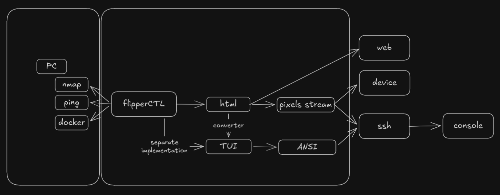
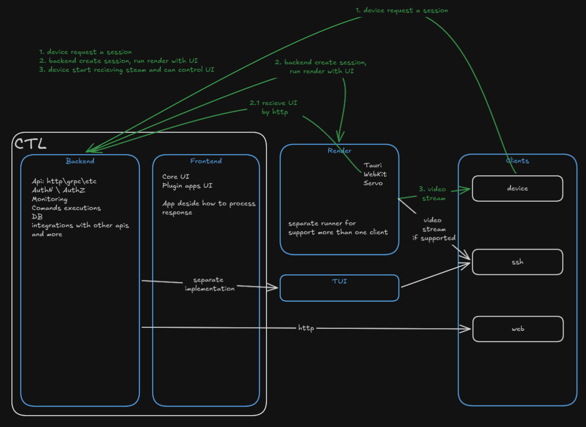

# Русская версия

Привет. Начну по порядку с того, что удалось протестировать и проверить.

# HTML UI

Идея выглядит хорошо: не нужно изучать что-то принципиально новое, можно быстро собрать готовый прототип.

Основной минус — для HTML нужно поднимать рендер.

В целом это единственное ключевое ограничение, от которого дальше зависят остальные решения.

# Overview



**flipperCTL** — backend, который управляет всем на компьютере через любое API: gRPC, HTTP и т.д.

**HTML** — UI, который отдается клиенту по HTTP: либо через рендер, либо напрямую в браузер.

**pixels stream** — изображение из рендера: видео или поток пикселей.

**device / flipperCTL display** — устройство запрашивает стрим из рендера и передает команды от кнопок обратно в рендер для управления UI.

**web** — браузер напрямую получает HTML UI, минуя рендер.

**TUI** — отдельная и более сложная часть. Готовых решений для конвертации HTML в TUI я не нашел.

Сейчас есть терминалы, которые поддерживают отображение видеострима. Также есть решения, которые рендерят HTML в консоль, но результат выглядит не очень хорошо и работает тяжеловато — не слишком отзывчиво для полноценного TUI.

Здесь нужно будет отдельно решить, какой вариант выбрать.

Можно реализовать базовое управление через TUI, но это будет полностью отдельная реализация от HTML UI. Поддерживать два отдельных UI не очень хочется.

# Render

Начну с того, что было новым. Идея такая: берем HTML, прогоняем его через движок, делаем скриншот и отправляем его в стрим.

## Tauri

Первая попытка — использовать решение, которое уже умеет работать с любым HTML-движком.

<video src="assets/tauri1.webm" controls width="600"></video>

```bash
cd screencaster && cargo run
```

Можно открыть стрим и увидеть, что все работает.

Ограничение в том, что у Tauri и похожих систем нет полноценного headless-режима, то есть дисплей все равно должен быть.

Это можно обойти через виртуальный дисплей, например `xvfb`.

Также нужно будет реализовать рендер не только через WebKit.

## Wails

Wails — Go-реализация, похожая на Tauri. У нее есть некий server mode, но в итоге это просто хостинг HTML без рендера.

Не подходит, потому что нет headless-рендера.

## WPE WebKit

WPE WebKit — WebKit-движок для embedded-платформ.

Есть зависимость от биндингов, но он работает в headless-режиме.

<video src="assets/wpe1.webm" controls width="600"></video>

```bash
cd wpe-screencaster && cargo run
```

## Servo

Servo поддерживает headless-режим. Это чистый Rust без внешних зависимостей.

Выглядит интересно, но, на мой взгляд, он еще долго будет находиться в активной разработке. Тем не менее его можно оставить как экспериментальный вариант под флагом.

<video src="assets/servo1.webm" controls width="600"></video>

```bash
cd servo-screencaster && cargo run
```

## Управление UI

Следующий шаг — проверить возможность управления UI.

Идея такая: передаем команды в JS-движок, он обрабатывает события, а рендер показывает обновленное видео.

Tauri:

<video src="assets/tauri2.webm" controls width="600"></video>

```bash
cd tauri-remote && cargo run
```

Servo:

<video src="assets/servo2.webm" controls width="600"></video>

```bash
cd servo-remote && cargo run
```

WPE:

<video src="assets/wpe2.webm" controls width="600"></video>

```bash
cd wpe-remote && cargo run
```

# Backend

Для реализации backend можно выбрать любой инструмент. Rust сейчас популярен, и, возможно, на нем получится сделать эффективное решение.

Можно добавить разные протоколы аутентификации и авторизации, подключать базы данных и использовать все, что доступно в обычных backend-системах.

Отдельно стоит сказать про вызов команд.

Через авторизацию будет определяться, какие команды может вызывать текущий пользователь.

Параметры будут передаваться из frontend, а результат будет возвращаться без изменений.

При необходимости можно предусмотреть разные конвертеры или санитизацию данных.

# Frontend

Можно поддерживать любой frontend-фреймворк. Все приложения могут быть упакованы в ZIP для последующего развертывания.

Сейчас я не вижу серьезных ограничений, кроме тех, которые могут появиться из-за дизайна или выбранного HTML-движка.

# Система плагинов

Сначала были мысли о шаблонах или блоках, которые нужно куда-то встраивать, но в процессе появилась более удачная идея.

Можно отображать любой frontend внутри `iframe`.

Таким образом, плагин — это ZIP-архив с `index.html`, манифестом и другими ассетами.

Core UI тоже может быть самостоятельным плагином. Например, в текущем варианте frontend собирается в `main.zip`.

Мы кладем архивы в папку `apps`, backend отдает список доступных приложений, а нужный frontend отображается в главном UI внутри `iframe`.

В манифесте можно будет указывать дополнительные параметры. Например, что для конкретного приложения нужен fullscreen `iframe`, как в случае с UI для радио.

Сюда хорошо ложится концепция Tauri с политиками разрешений для UI. Можно не изобретать велосипед и использовать похожий подход.

<video src="assets/fe-plugin.webm" controls width="600"></video>

Собираем frontend и плагин:

```bash
cd frontend && npm run pack
cd ./..
cd frontend-ifconfig && npm run pack
cd ./..
cd backend && cargo run
```

Запускаем UI:

```bash
cd tauri-app && cargo tauri dev
```

# Рендер: render-rs

Итог экспериментов с рендером собран в `render-rs` — headless-рендер с движком, выбираемым на этапе сборки:

```bash
cd render-rs

# WPE WebKit (по умолчанию, C-биндинги, бинарь ~5 MB)
cargo run -- --url http://localhost:5173/

# Servo (чистый Rust, без системных зависимостей)
cargo build --release --no-default-features --features servo
```

Возможности:

- несколько рендеров одновременно — каждый забирает HTML с указанного endpoint (`--url` или `POST /api/renders`);
- видео рендера по WebSocket (PNG-кадры) + фоллбек multipart-стримом; поток идет с постоянным fps, даже если страница статична;
- raw-подписка для дисплеев: тот же WebSocket с `?format=rgb565&w=256&h=144&fps=10` — сервер сам конвертирует пиксели под матрицу, у каждого подписчика свой темп;
- удаленное управление по API: мышь, клавиатура, колесо (`POST /api/renders/{id}/input` или те же события текстом в WebSocket);
- скриншот последнего кадра: `GET /api/renders/{id}/frame`;
- встроенный viewer (`/view/{id}`) с пробросом мыши и клавиатуры и менеджер рендеров (`/`).

Подробности в [render-rs/README.md](render-rs/README.md).

## Пиксельные шрифты и движки

Набитые шишки, чтобы UI оставался пиксель-в-пиксель:

- Servo мылит мелкие векторные шрифты — лечится отключением антиалиасинга текста на уровне движка (`gfx_text_antialiasing_enabled = false`, уже включено в render-rs);
- размеры шрифта и иконок должны быть кратны пиксельной сетке (Press Start 2P — сетка 8×8 → размеры 8/16px; иконки 8×8 → 16/24px), иначе глифы режутся и плывут;
- viewer масштабирует canvas только целым коэффициентом с учетом devicePixelRatio — дробный масштаб выбрасывает ряды пикселей;
- для маленьких матриц рендер создается сразу в родном разрешении (`width:256, height:144`), а не даунскейлится — иначе от текста остаются точки.

# USB-дисплей: display-agent

Мост между рендером и внешним дисплеем (MCU): подписывается на raw-поток рендера и пишет кадры в sink фреймированным бинарным протоколом (`0xA5 | type | len | ts | body`). Устройство остается тупым — рисует кадры и шлет коды кнопок обратно.

```bash
# стрим в файл — валидация без железа
cd display-agent
cargo run -- stream --url ws://localhost:8090/api/renders/1/ws \
  --format rgb565 --width 256 --height 144 --fps 10 --out file:stream.bin

# проверка потока: пейсинг, целостность, пропуски кадров; кадр N — в PNG
cargo run -- inspect stream.bin --dump 50:frame.png
```

Кадр 256×144 rgb565 = 72 KB, при 10 fps ~720 KB/s — влезает в full-speed USB CDC. Sink `serial:/dev/ttyACM0` — следующий шаг, протокол под него готов (включая обратные пакеты кнопок). Подробности в [display-agent/README.md](display-agent/README.md).

# Демо одной командой

Зависимости (Rust, Node, тулчейн servo) — команды по порядку под свою ОС:
[INSTALL-linux.md](INSTALL-linux.md) / [INSTALL-macos.md](INSTALL-macos.md).

Дальше:

```bash
./scripts/demo.sh              # debug-сборка
./scripts/demo.sh --release    # release-сборка
```

Скрипт собирает фронтенды в `apps/*.zip`, бекенд и render-rs (servo), поднимает бекенд, находит все приложения через `/api/apps`, запускает рендер на каждое и печатает ссылки на viewer'ы. Ctrl+C гасит весь стек.

# Выводы

HTML и все вокруг него добавляют высокую гибкость для UI и системы плагинов.

Вариант с разделением backend и frontend — известная формула. Для такого подхода уже существует огромный набор инструментов и готовых решений.

Основные сложности могут быть связаны с кроссплатформенностью, системой рендера и удаленным управлением UI. С такими задачами приходится работать нечасто, поэтому там могут быть подводные камни.


